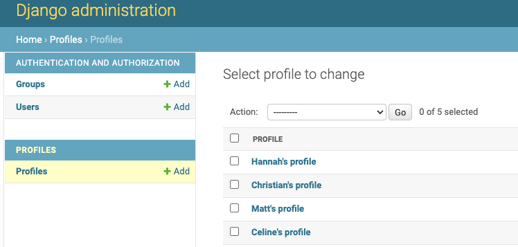

# Name pending

## Navigation Through Content
#
* [Deployed page]()
* [Project Purpose](#project-purpose)
    - [Learning Outcomes](#learning-outcomes)
    - [Project Requirements](#project-requirements)
* [Initial Planning](/deployment.md)
* [Initial SetUp](/setup.md)
    - [Set up repository](#set-up-repository)
    - [Set up project in GitPod](#set-up-project-in-gitpod)
    - [Set up....]()
* [User Experience](#user-experience-ux)
    - [Demographics](#demographics)
    - [User Goal](#user-goals)
* [Features](/features.md)
   - [Existing features](/features.md#existing-features)
   - [Possible improvements](/features.md#features-left-to-implement)
* [Testing](/testing.md)
    - [Validator Testing](/testing.md#validator-testing)
    - [Manual testing](/testing.md#manual-testing)
    - [Automated Testing](/testing.md#automated-testing)
* [Bugs](/bugs.md)
* [Deployment](/deployment.md)
* [Credits](#credits)
    - [Mentoring](#mentoring)
    - [Content credits](#content-credits)
    - [Media](/credits.md)
      -[Blog Content credits](/credits.md#blog-content-credits)
        - [Why Soil Matters](/credits.md#why-soil-matters)
        - [How to grow tomatoes](/credits.md#how-to-grow-tomatoes)
        - [How to grow carrots](/credits.md#how-to-grow-carrots)
        - [The humble potatoe](/credits.md#the-humble-potatoe)
        - [The frail but worth it salad](/credits.md#the-frail-but-worth-it-salad)
        - [The hearty onion](/credits.md#the-hearty-onion)
        - [The plump Bell Pepper](/credits.md#the-plump-bell-pepper)
     - [Image Credits](/credits.md#image-credits)
        - [About us picture](/credits.md#about-us-picture)
        - [Favicons](/credits.md#favicons)
        - [Creation Credits](/credits.md#creation-credits)
#
## First setup
#
- Testing done to ensure successful initial launch in preview and functionality of profiles app.
- Test also successfull in Heroku.
#
Launch Successful in preview                         | Profiles succesfull
:--------------------------------------------------: | :--------------------------------------------------:
 | 
#
Successfull launch in Heroku                        |
:--------------------------------------------------:|
  

#
## Testing in development
#
- After creation of a superuser.
   -Test to see that /admin worked and that admin view is running correctly
   - created 4 other profiles
      - Test if default image works
      - Test if password requirements work.
#
Admin view testing  
   
#
Profiles created in admin view, has default image
   
#
- Testing done on profile:
   - Possible for superuser to edit user profiles in UI.
      - Future testing to see if another regular user can change info on other users.
   - Testing done on profile 1, 3 and 5 after adding authentication. Testing also in logged out state. Only owner can access edit tool for profile.
   -After refactoring:
      - test delete profile, successfull
      - No access to delete other users profiles
   - Test filtering profiles:
       - after which profile is following who and order in descending and ascending order for follow count, post count, owner following created at. 
       - profiles following other profiles or not and then ordering then differently ascending and descending order.

- Testing done on post:
   - Unathorized user creating posts
   - uploading files that are to big.
   - Not filling out title-field.
   - View for other authorized users, no edit functionality on posts.
   - After refactoring:
      - test entire crud functionality and view from nonowner view.
   - After adding like_id to posts, testing to see if create and delete like functions successfully.
   -test filtering functions.
       - Order posts on number of likes, number of comments and when posts where liked. 
       - filtering on profiles a user is following, likes and posts.

- Testing done on comments:
   - Creating, editing and deleting post as authorized user.
   -Accessing comment as other authenticated user. Read only.
   - Accessing comment as unathenticated user. Read only.
   - Test filtering comments of different user's posts.
- Testing done on like:
   - Unauthenticated users, no access to liking posts
   - Authenticated users can like posts.
   -If tried twice error-page.
   - Authenticated and authorized user can delete like.
- Testing done on followers:
   - test following authenticated users as a authenticated user.
   - No access to follow authenticated user while not logged in.
   - Successful unfollowing a authentictated user as a logged in user.
   - A user can't remove an authenticated User from their followers list.

#
* [Back to top](#)
#